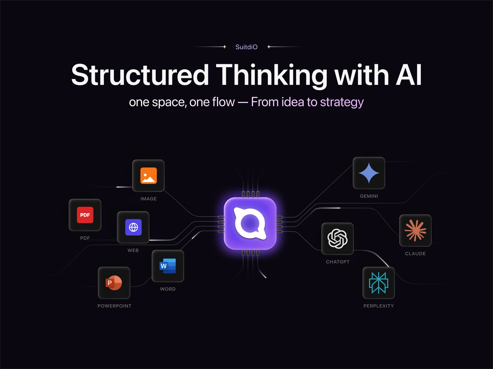
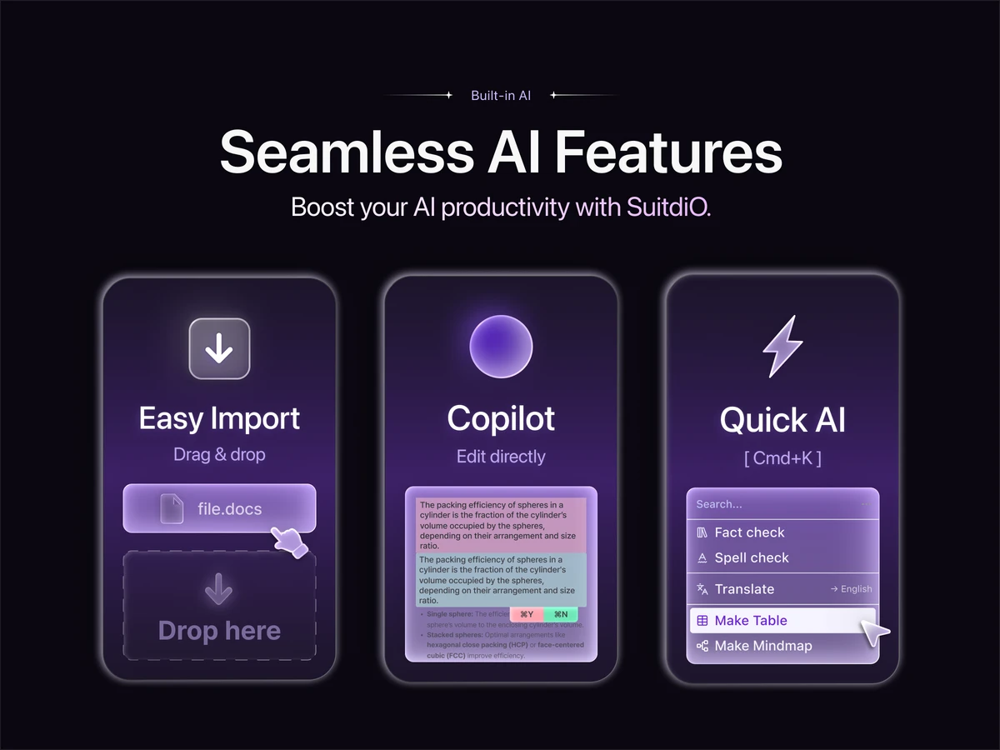
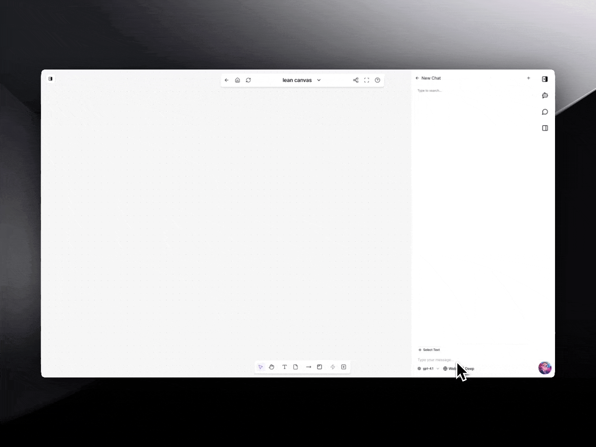
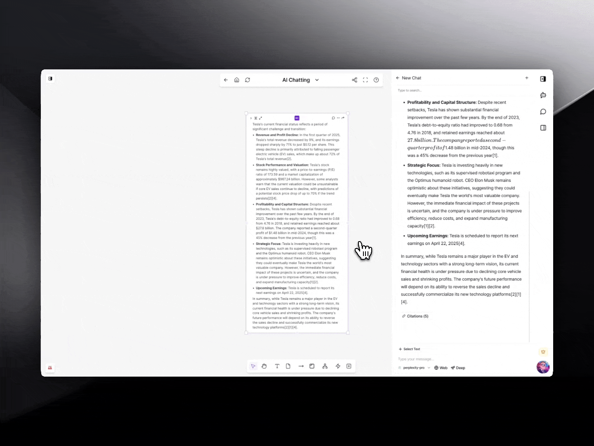
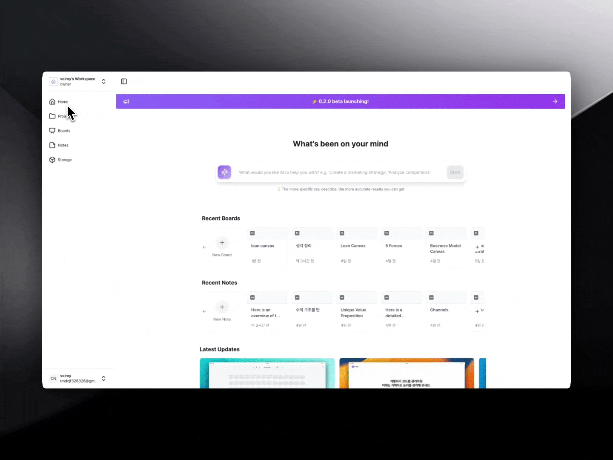

# Suitdio (수트디오)

> AI 시대, 기획자를 위한 가장 낮은 전환비용의 비주얼 워크스페이스
> **Structured Thinking with AI** — one space, one flow: from idea to strategy

이 저장소는 실제 서비스 코드의 **개발 중간 단계 스냅샷**입니다 (`develop` 브랜치, 화살표·노드·섹션·마인드맵 핵심 기능이 구현된 시점). 완성된 최신 버전은 기술이전 이슈로 비공개이며, 포트폴리오 참고용으로 공개되었습니다.

## 화면

<p align="center">
  
  <br/><sub>랜딩페이지 — 멀티포맷 임포트 + 멀티 AI 모델 연동</sub>
</p>

<p align="center">
  
  <br/><sub>Easy Import / Copilot(인라인 편집) / Quick AI(Cmd+K) 소개</sub>
</p>

<p align="center">
  
  <br/><sub>보드 캔버스 + AI Chat 사이드바가 나란히 배치된 실제 화면</sub>
</p>

<p align="center">
  
  <br/><sub>Perplexity 리서치 결과(출처 인용 포함)를 텍스트 위젯으로 옮겨 정리하는 실사용 화면</sub>
</p>

<p align="center">
  
  <br/><sub>홈 화면 — AI 프롬프트 입력, 최근 보드/노트, 업데이트 노트</sub>
</p>

## 서비스 소개

Suitdio는 기획(설계)자를 위한 AI 작업 공간입니다. 비효율이 당연하게 여겨져 온 기획 업무의 생산성을 확보하는 것을 목표로, 보드 위에서 자유롭게 생각을 정리하고 그 구조 위에서 바로 AI를 활용할 수 있도록 만들었습니다.

- **해결하려는 문제**: 기존 노트테이킹 도구들은 비주얼적으로 직관적이지 않아 정리에 드는 리소스가 크고, 그로 인해 사용을 포기하는 사람이 많습니다. Suitdio는 직관적인 시각적 메모 환경과 그 메모를 기반으로 동작하는 AI를 결합해 이 문제를 해결합니다.
- **주요 사용자**: 기획자, 사업개발(BD), 프로그래머, 디자이너 등 의사결정이 잦은 지식노동자
- **핵심 전략**: `포커싱` + `간편함` = Real Productive

## 핵심 기능

### 보드 (Board)
- **노드(위젯) 생성·수정·삭제·이동**: Redux 기반 CRUD + Command 패턴으로 undo/redo(최대 20단계) 지원
- **화살표(Arrow)**: 외부 캔버스 라이브러리 없이 Canvas 2D API로 직접 렌더링. 두 위젯의 겹치지 않는 변을 자동으로 찾아 연결하고, 좌/우 헤드를 개별적으로 켜고 끌 수 있어 방향을 자유롭게 표현 가능
- **섹션(Section)**: 위젯을 그룹으로 묶어 관리. 완전 포함 기준으로 소속 여부 판정
- **마인드맵(Mindmap)**: 화살표로 연결된 노드들의 관계를 기반으로 계층 구조를 자동 계산해 트리 형태로 재배치. dagre/elk 같은 외부 레이아웃 라이브러리 없이 자체 재귀 알고리즘으로 구현(순환 연결 방지 가드 포함)
- **중앙 위젯 / 텍스트 위젯**: BlockNote 기반 리치 텍스트 에디터, 텍스트 위젯을 보드로 변환해 정리하는 기능
- **다양한 위젯**: 브레인스톰, 노트(포스트잇), 보드, 코멘트, 웹/PDF/이미지 임베드

### AI 연동
- 파일(이미지/PDF/PPT/Word) 드래그&드롭으로 손쉬운 임포트
- 문서 내 인라인 AI 편집(Copilot)
- Cmd+K 퀵 액션(팩트체크, 맞춤법 검사, 번역, 표 생성, 마인드맵 생성 등)
- ChatGPT, Claude, Gemini, Perplexity 등 다양한 AI 모델 연동, AI 리서치 결과를 보드 위젯으로 바로 옮겨 정리하는 워크플로우 지원

### 실시간 협업
- Socket.io 기반 WebSocket으로 위젯 생성/수정/삭제/이동을 실시간 동기화

## 데이터 구조

### 위젯(엘리먼트) 공통 스키마

모든 보드 위의 객체(텍스트, 화살표, 섹션 등)는 아래 공통 필드를 가지는 형태로 서버와 동기화됩니다.

```json
{
  "id": "1234",
  "type": "section",
  "x": 100,
  "y": 200,
  "z": 1,
  "width": 300,
  "height": 200,
  "rotation": 0,
  "property": {},
  "content": { "text": "New Section" },
  "created": "2024-10-16T10:00:00Z"
}
```

### 액션 타입 (서버 동기화)

위젯 변경 사항은 4가지 액션 타입의 JSON payload로 서버와 주고받습니다.

| 액션 | 설명 |
|---|---|
| `createElement` | 위젯 생성 |
| `updateElement` | 속성 변경 (텍스트 색상, 화살표 시작/끝점 등) |
| `deleteElement` | 위젯 삭제 |
| `moveElement` | 위치·z-index 변경 |

```json
// 화살표 시작/끝점 변경 예시
{
  "action": "updateElement",
  "data": {
    "id": "5678",
    "content": { "start": [100, 100], "end": [300, 400] },
    "updated": "2024-10-16T10:10:00Z"
  }
}
```

재접속 시에는 좌표를 그대로 복원하는 게 아니라, 저장된 위젯들의 현재 좌표를 기준으로 화살표 위치를 다시 계산해 렌더링합니다.

### 관계 모델

- **화살표(Arrow)**: `fromId` / `toId`로 두 위젯 간의 비계층적 연결을 표현. 관계 정보는 Arrow 엔티티와 각 Widget의 `to`/`from` 배열, 두 곳에 동시에 저장되며 CRUD 시 둘 다 함께 갱신됩니다.
- **섹션(Section)**: 위젯이 섹션 영역에 완전히 포함되는지(전체 포함 기준)로 소속 여부를 판정하는, 유일하게 실제 부모-자식 계층을 가지는 관계입니다.
- **마인드맵**: 화살표의 `fromId → toId` 관계를 순회해 런타임에 트리 구조로 변환한 뒤 레이아웃을 계산합니다. DB에 트리로 저장되는 것이 아니라 매번 파생되는 뷰입니다.

### 상위 계층 구조

```
Workspace
 └─ Project
     └─ Board ↔ BoardLink (보드 간 연결)
         └─ WidgetInstance (보드에 소속된 위젯)
     └─ Widget (원본 객체, 여러 Board에 공존 가능)
```

## 기술 스택

- **프레임워크/언어**: Next.js 14(App Router), React 18, TypeScript 5
- **상태관리**: Redux Toolkit + react-redux
- **스타일**: Tailwind CSS, Radix UI
- **에디터**: BlockNote
- **실시간 통신**: Socket.io-client
- **서버 통신**: axios

## 개발 히스토리

이 프로젝트는 초기에 "QueueFeed"라는 이름으로 시작해, 팀이 피봇하며 화이트보드 프로토타입(`Konva` 기반)을 개발했고, 이후 성능과 커스터마이징을 위해 순수 Canvas 2D API 기반의 자체 렌더링 엔진으로 전환하며 "Suitdio"로 리브랜딩되었습니다.

---

*이 저장소는 개인 포트폴리오 목적으로 공개된 스냅샷이며, 실제 운영 중인 서비스와는 차이가 있을 수 있습니다.*
